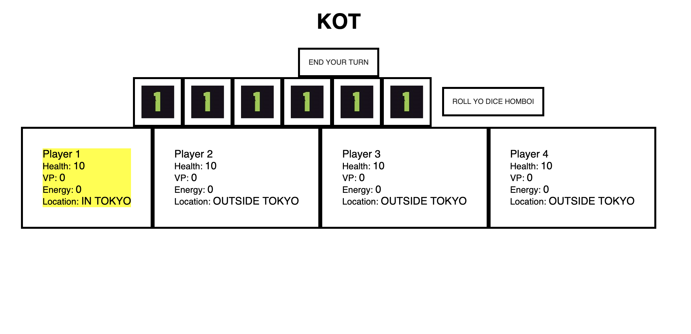

# project-king-of-tokyo
This is a project where I make a replica of the board game King of Tokyo. The technologie used in this game is jquery, javascript, html5, and css. The object of this game is to either kill off the other players by getting to them to 0 health, or being the first person to reach 20 victory points. Th active playefrs turn will be highlighted in yellow. 

You begin by rolling the dice. You get to roll a total of 3 times. With these 3 rolls you are ahle to keep certain dice that you want, by left clicking on the dice. when the dice is selected it will be surrounded by a red border, and it will not change on your next roll. To end your turn, press the button that says "end your turn". There is a player that is inside tokyo, and the rest of the players are outside of tokyo. When the game begins the first player will automatically start inside tokyo. The only way to leave tokyo, is by taking damage from another person, and choosing to leave tokyo at that time, unless of course you choose option 2 on how to leave tokyo, which is by dieing. 

